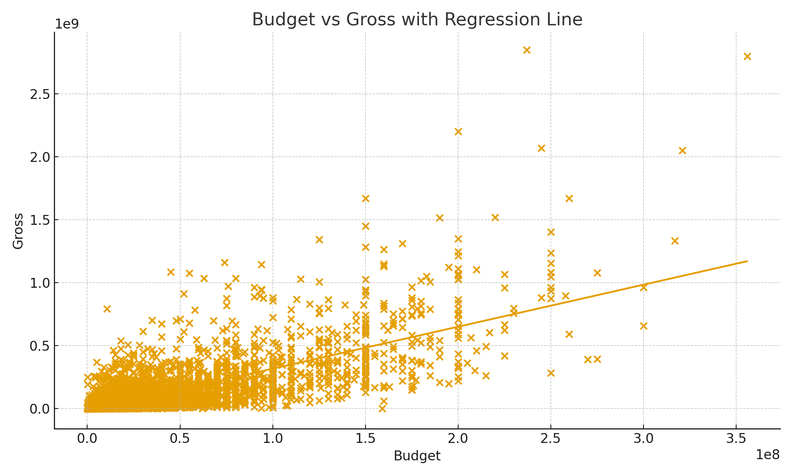
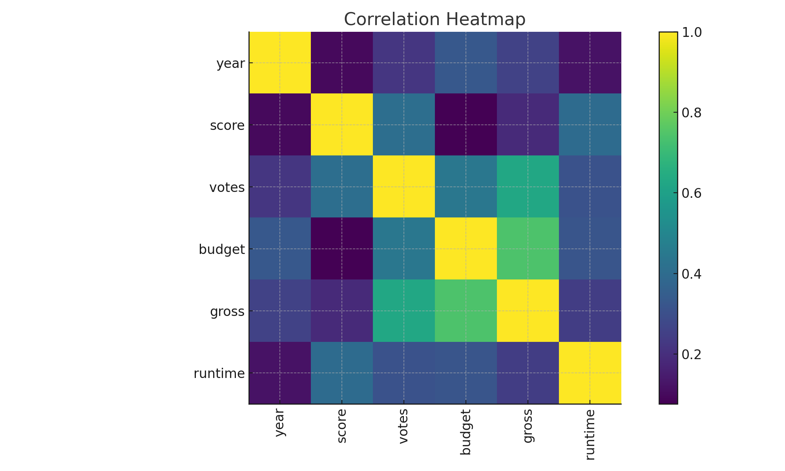

# Movie Correlation Analysis in Python

## 1. Background & Overview
The goal of this project was to understand what drives box office performance by analyzing relationships between movie features such as budget, gross revenue, votes, score, and more.

Using Python libraries like Pandas, NumPy, Matplotlib, and Seaborn, this project explores:
- How movie budgets influence revenue
- Which features–like votes or runtime–correlate most with success
- Visual patterns across the dataset
- Encoded categorical correlations for deeper insight

This project showcases my foundational skills in data cleaning, correlation analysis, visualization, and feature transformation.

## 2. Data Structure & Cleaning Summary

Key Columns in the Dataset
- name, director, company
- budget, gross
- rating, genre
- score, votes, runtime
- released (year extracted into yearcorrect)

Main Cleaning Steps
- Identified and quantified missing values
- Converted numeric fields to nullable Int64
- Extracted release year using regex
- Sorted values by gross for quick insights
- Removed duplicates
- Encoded categorical fields for correlation analysis
- Generated both standard and encoded correlation matrices

## 3. Visual Explorations

### A. Budget vs Gross (Scatter Plot)
Higher budgets generally lead to higher gross revenue, though variability shows differing returns on investment.

)

### B. Budget vs Gross
A regression plot highlights the strong positive relationship between investment and financial output.

### C. Correlation Heatmap
The strongest correlations appear between gross–budget and gross–votes.

## 4. Correlation Findings

### Top Positive Correlations

| Feature A | Feature B | Correlation |
|-----------|-----------|-------------|
| gross     | budget    | 0.74 |
| gross     | votes     | 0.63 |
| budget    | votes     | 0.44 |
| score     | votes     | 0.41 |
| runtime   | score     | 0.39 |

Interpretation
- Budget is the largest predictor of financial success.
- Votes measure popularity and strongly correlate with earnings.
- Score matters less than popularity when it comes to revenue.
- Production company shows little correlation—resources matter more than the name.

## 5. Insights Deep Dive

A. Bigger Budgets Drive Performance
Higher budgets → more marketing → wider releases → more revenue.

B. Audience Engagement Reflects Success
Votes correlate strongly with gross revenue because more visibility → more watchers → more earnings.

C. Encoded Categorical Variables Reveal Limited Predictive Power
After converting genre, director, company, and country to numeric codes, correlations remain weak, indicating these fields are less tied to financial outcomes.

D. Sorted Correlation Pairs Confirm the Strongest Signals
Unstacking and sorting the correlation matrix reveals:
- Gross ↔ Budget and Gross ↔ Votes dominate
- Most other variables fall below meaningful thresholds

## 6. Conclusion

- Allocate Budgets Strategically:
    - Invest more in concept-driven or high-potential titles to maximize returns.

- Boost Audience Engagement:
    - Since votes strongly correlate with revenue, build buzz early through marketing, press tours, and social media.
      
- Expand Predictive Modeling:
    - Future work could incorporate:
    - Cast information
    - Release seasonality
    - Streaming performance
    - Award nominations
    - Genre clusters

This would strengthen forecasting and provide deeper insight into what drives box office success.
